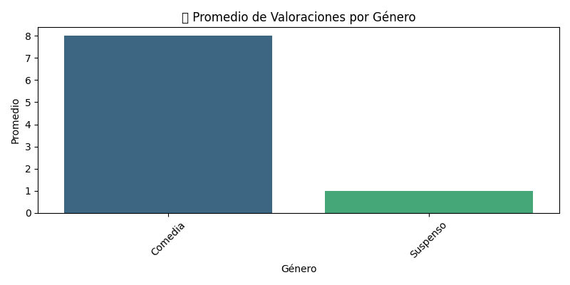

# 📚 Sistema de Gestión de Biblioteca - Django + DRF

Proyecto de backend en Python usando Django y Django REST Framework, que permite la administración de una biblioteca con funcionalidades para manejar libros, autores y clasificaciones. También permite almacenar el archivo libro electronico y realizar análisis sobre valoraciones usando Pandas.

---

## 🚀 Instalación paso a paso

1. Clonar el repositorio:

git clone https://github.com/abenitez49/services_biblioteca.git

cd project_libreria

Crear entorno virtual e instalar dependencias:

2. Crear entorno virtual e instalar dependencias
✅ python -m venv venv
✅ .\venv\Scripts\activate

✅ pip install django
✅ pip install djangorestframework
✅ pip install djangorestframework-simplejwt
✅ pip install django_extensions
✅ pip install psycopg
✅ pip install psycopg2
✅ pip install django-cors-headers

2.1 Migraciones e iniciar servidor:

✅ python manage.py migrate
✅ python manage.py runserver

3. ¿Qué funcionalidades ofrece?
✅ Registro y login de usuarios con JWT (Bearer Token)
✅ ABM de autores, géneros, libros y calificaciones
✅ Asociación de libros con autores y géneros
✅ Carga de libros en formato .epub en la carpeta media/{idlibro}/[nombre libro].epub
✅ Endpoint de búsqueda de libros con validación
✅ Carga y visualización de calificaciones con embeddings
✅ Gráficos automáticos con Pandas/Matplotlib
✅ Recomendaciones de libros por género basadas en promedio de valoraciones
✅ Análisis e insights estadísticos sobre las valoraciones
✅ Sistema extendible y limpio

✅ Se adjunta el git del front que se realizo consumiendo los servicios de este sistema: https://github.com/abenitez49/services_biblioteca_vue

4. 📁 Estructura del proyecto

biblioteca/
├── autores/
├── calificaciones/
├── generos/
├── libros/
├── media/       # PDFs almacenados
├── project_libreria/
├── utils/
├── screenshots/ #imagenes
└── manage.py

📸 Capturas del collection de postman 
* Collection en postman todas las carpetas comparten el mismo contenido formato

📸 Pequeñas secciones de codigo

📘 Crear un libro

# views.py
def post(self, request):
        serializer = LibrosSerializer(data=request.data, context={'request': request})
        if serializer.is_valid():
            serializer.save()
            return Response({
                'success': True,
                'message': 'Libro creado correctamente.',
                'data': serializer.data
            }, status=status.HTTP_201_CREATED)
        return Response({
            'success': False,
            'message': 'Error al crear el libro.',
            'errors': serializer.errors
        }, status=status.HTTP_400_BAD_REQUEST)

📚 Listado de libros

# views.py
def get(self, request):
        libros = LibrosModel.objects.all()
        serializer = LibrosSerializer(libros, many=True)
        return Response({
            'success': True,
            'message': 'Libros obtenidos correctamente.',
            'data': serializer.data,
            'count': len(serializer.data)
        }, status=status.HTTP_200_OK)

5. Análisis con Pandas

En analisisdatos/analisis_calificaciones.py se encuentra el script que permite:

Calcular y graficar el promedio de valoraciones por género

Mostrar:

📉 Libro peor valorado

📊 Libro más calificado (más valoraciones recibidas)

🌟 Libro más recomendado (mayor promedio de puntuación)

Permitir al usuario ingresar un ID de género y sugerir el libro más recomendado en base al promedio de calificaciones.

📚 Géneros disponibles:
  📘 1 - Ciencia Ficción
  📘 2 - Fantasía
  📘 3 - Romance

🔎 Ingresá el ID del género para sugerir el mejor libro: 2

✅ El libro más recomendado del género 'Fantasía' es:
📕 El ojo del samurai (promedio: 4.80)

📈 Gráficos generados
Género más valorado (en el momento de haer este readme con los datos existentes)

🔍 Sugerencias y futuros análisis

📘 Recomendaciones por género basadas en promedio de puntuación ✅

🧠 Integración de embeddings para análisis semántico de valoraciones (pendiente)

📊 Análisis de patrones de usuarios, sentimientos y recomendaciones automáticas (en desarrollo)

🔒 Licencia
Este proyecto está bajo la licencia Alexis. Consultá el archivo LICENSE para más información.
