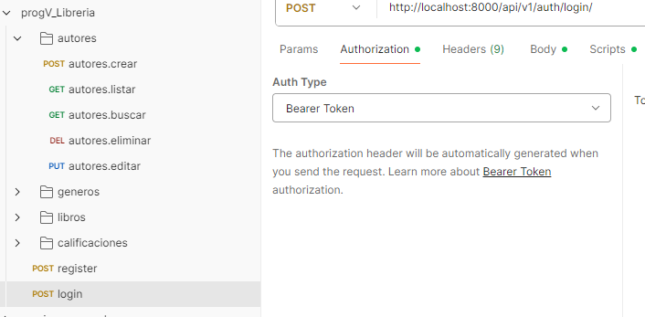

# 📚 Sistema de Gestión de Biblioteca - Django + DRF

Proyecto de backend en Python usando Django y Django REST Framework, que permite la administración de una biblioteca con funcionalidades para manejar libros, autores y clasificaciones. También permite almacenar PDFs y realizar análisis sobre valoraciones usando Pandas.

---

## 🚀 Instalación paso a paso

1. Clonar el repositorio:

```bash
git clone [https://github.com/tu-usuario/tu-repo.git](https://github.com/abenitez49/services_biblioteca.git)
cd project_libreria
Crear entorno virtual e instalar dependencias:


python -m venv venv
.\venv\Scripts\activate
pip install -r requirements.txt
Si no tenés un requirements.txt, podés instalar manualmente con:


pip install django
pip install djangorestframework
pip install djangorestframework-simplejwt
pip install django_extensions
pip install psycopg
pip install psycopg2
pip install django-cors-headers
Migraciones e iniciar servidor:


python manage.py migrate
python manage.py runserver

🧠 ¿Qué hace este sistema?
Alta, baja, modificación y listado de autores, generos, libros y calificaciones.Tambien registro de usuarios y login de los mismos, atravez de inicio de sesion se obtiene el token necesario para realizar las peticiones a los servicios el metodo de autenticacion es 'Bearer Token'.

Asociación de libros con autores y clasificaciones.

Carga y almacenamiento de en formato correspondiente utilizamos como ejemplo los libros electronicos cuyo formato estan en epub de libros en carpeta media/{idlibro}/[nombre libro].

Endpoint de búsqueda de libros por ID con validación de existencia.

Clasificaciones con modelo de (embeading) (por implementar).........
*
*
*
*

API limpia y funcional, con JWT para autenticación.

📁 Estructura del proyecto

biblioteca/
├── autores/
├── calificaciones/
├── generos/
├── libros/
├── media/       # PDFs almacenados
├── utils/
└── manage.py
📸 Capturas del collection de postman 
* Collection en postman todas las carpetas comparten el mismo contenido formato



📘 Crear un libro
python
Copiar
Editar
# views.py
class LibroCreateAPIView(APIView):
    def post(self, request):
        # lógica para crear libro...

📚 Listado de libros
python
Copiar
Editar
# views.py
class LibroListAPIView(APIView):
    def get(self, request):
        # lógica para listar libros...

📊 Valoraciones y análisis con Pandas
Usamos Pandas para analizar valoraciones de libros:

python
Copiar
Editar
import pandas as pd

df = pd.read_csv('valoraciones.csv')
valoradas = df.groupby("genero")["puntuacion"].mean()
print(valoradas)
📈 Gráficos generados
Género más valorado


Pregunta de análisis libre
¿Cuáles son los autores con más libros valorados positivamente?


💡 Sugerencias por género
Al seleccionar un género, el sistema puede recomendar libros del mismo género que hayan sido bien valorados.

🧪 Embedding de calificaciones (pendiente)
📝 Sección vacía – próximamente se integrará un sistema de embeddings para análisis semántico de valoraciones.

🐼 Integración avanzada con Pandas (pendiente)
📝 Sección vacía – se agregará procesamiento adicional de datasets con Pandas, exploración de patrones, etc.

🔒 Licencia
Este proyecto está bajo la licencia Alexis. Consultá el archivo LICENSE para más información.
