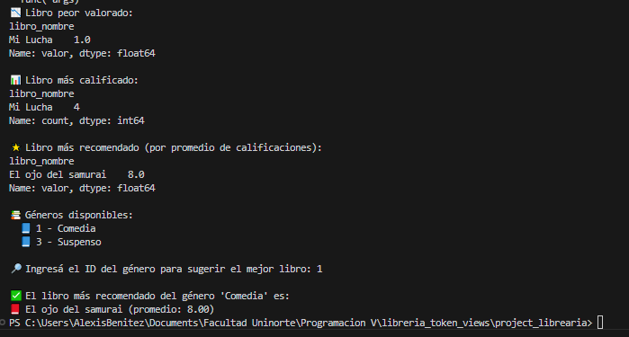

## 📚 Sistema de Gestión de Biblioteca - Django + DRF

Proyecto de backend en Python usando Django y Django REST Framework, que permite la administración de una biblioteca con funcionalidades para 
manejar libros, autores y clasificaciones. También permite almacenar el archivo libro electrónico y realizar análisis sobre valoraciones usando Pandas.

---

## 🚀 Instalación paso a paso

### 1. Clonar el repositorio

```bash
git clone https://github.com/abenitez49/services_biblioteca.git

cd project_libreria
````

### 2. Crear entorno virtual e instalar dependencias

```bash
python -m venv venv
.\venv\Scripts\activate
```

```bash
pip install django
pip install djangorestframework
pip install djangorestframework-simplejwt
pip install django_extensions
pip install psycopg
pip install psycopg2
pip install django-cors-headers
```

### 2.1 Migraciones e iniciar servidor

```bash
python manage.py migrate
python manage.py runserver
```

---

## ✅ ¿Qué funcionalidades ofrece?

* Registro y login de usuarios con JWT (Bearer Token)
* ABM de autores, géneros, libros y calificaciones
* Asociación de libros con autores y géneros
* Carga de libros en formato `.epub` en la carpeta `media/{idlibro}/[nombre libro].epub`
* Endpoint de búsqueda de libros con validación
* Carga y visualización de calificaciones con embeddings
* Gráficos automáticos con Pandas/Matplotlib
* Recomendaciones de libros por género basadas en promedio de valoraciones
* Análisis e insights estadísticos sobre las valoraciones
* Sistema extendible y limpio

> ✅ Se adjunta el git del front que se realizó consumiendo los servicios de este sistema:
> [https://github.com/abenitez49/services\_biblioteca\_vue](https://github.com/abenitez49/services_biblioteca_vue)

---

## 📁 Estructura del proyecto

```
biblioteca/
├── autores/
├── calificaciones/
├── generos/
├── libros/
├── media/             # PDFs almacenados
├── project_libreria/
├── utils/
├── screenshots/       # Imágenes
└── manage.py
```

---

## 📸 Capturas del Collection de Postman

> *Collection en Postman: todas las carpetas comparten el mismo contenido/formato*


---

## 📘 Pequeñas secciones de código

### Crear un libro

```python
# views.py
def post(self, request):
    serializer = LibrosSerializer(data=request.data, context={'request': request})
    if serializer.is_valid():
        serializer.save()
        return Response({
            'success': True,
            'message': 'Libro creado correctamente.',
            'data': serializer.data
        }, status=status.HTTP_201_CREATED)
    return Response({
        'success': False,
        'message': 'Error al crear el libro.',
        'errors': serializer.errors
    }, status=status.HTTP_400_BAD_REQUEST)
```

---

### Listado de libros

```python
# views.py
def get(self, request):
    libros = LibrosModel.objects.all()
    serializer = LibrosSerializer(libros, many=True)
    return Response({
        'success': True,
        'message': 'Libros obtenidos correctamente.',
        'data': serializer.data,
        'count': len(serializer.data)
    }, status=status.HTTP_200_OK)
```

---

## 🧠 Análisis con Pandas

En `analisisdatos/analisis_calificaciones.py` se encuentra el script que permite:

* Calcular y graficar el **promedio de valoraciones por género**
* Mostrar:

  * 📉 Libro peor valorado
  * 📊 Libro más calificado (más valoraciones recibidas)
  * 🌟 Libro más recomendado (mayor promedio de puntuación)
    
* Permitir al usuario ingresar un ID de género y sugerir el libro más recomendado en base al promedio de calificaciones que tiene.

### 📚 Géneros disponibles

```
📘 1 - Ciencia Ficción
📘 2 - Fantasía
📘 3 - Romance
```

```
🔎 Ingresá el ID del género para sugerir el mejor libro: 2

✅ El libro más recomendado del género 'Fantasía' es:
📕 El ojo del samurai (promedio: 4.80)
```

---

## 📈 Gráficos generados

> Género más valorado (en el momento de hacer este README con los datos existentes)


---

## 🔍 Sugerencias y futuros análisis

* 📘 Recomendaciones por género basadas en promedio de puntuación ✅
* 🧠 Integración de embeddings para análisis semántico de valoraciones (pendiente)
* 📊 Análisis de patrones de usuarios, sentimientos y recomendaciones automáticas (en desarrollo)

---

## 🔒 Licencia

Este proyecto está bajo la licencia **Alexis**. Consultá el archivo `LICENSE` para más información.


